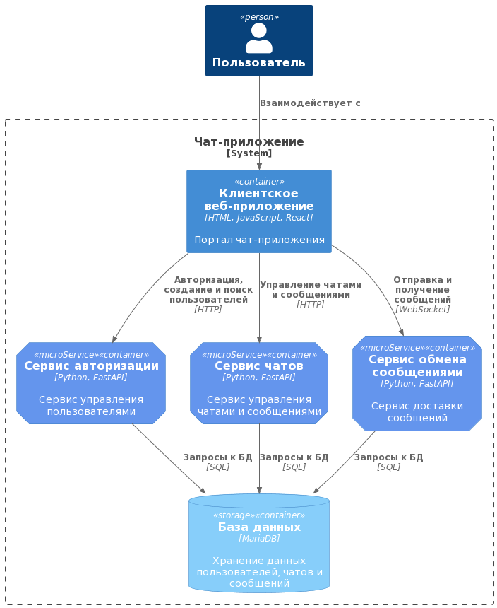
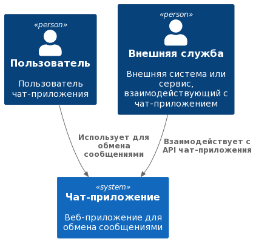

# Лабораторная работа №1

Вполнил: Стрыгин Д.Д.\
группа: М8О-111М-23\
вариант: 5

## Задание

- Должны быть спроектированы сервисы, согласно вашему варианту задания
- Должны быть указаны вызовы между сервисами
- Должны быть описаны API (методы, входы, выходы)
- Должна быть описана логическая модель данных

## Результаты
C4 - диаграмма компонентов



Логическая модель



Описания апи лежат в по пути
```
diagrams/src/components.md
```

## Выводы
С4 диаграммы, записанные кодом обладают рядом преимуществ и недостатков:
- У них есть удобный версионный контроль
- Визаульно перегруженная диаграмма может отрендерится хуже, чем вручную
- Есть порог вхождения для использования таких диаграмм (в отличие от drow.io)
